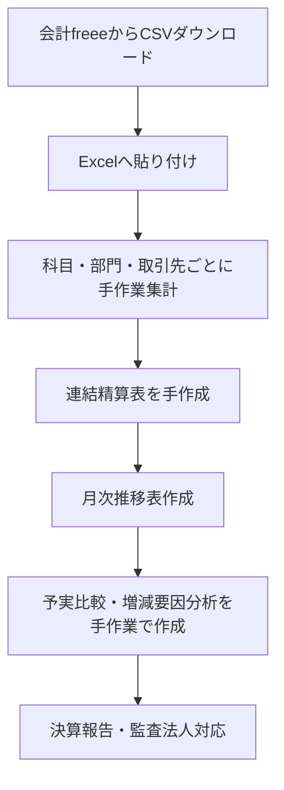
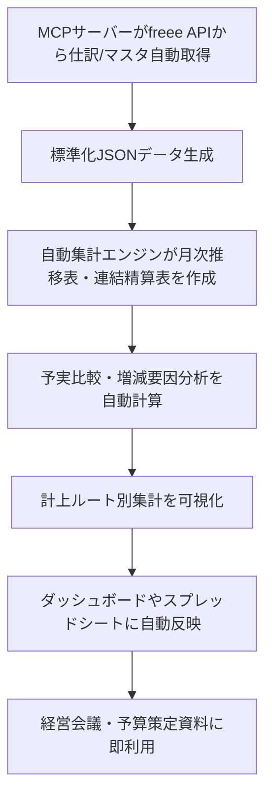

# ✅ 業務フロー定義書（To-Be含む）

## 1. 現状業務フロー（As-Is）

課題：

* 手作業工程が多く、人的ミスリスクが高い
* 集計に数時間〜数日かかる
* 部門・取引先別集計は一部しか対応できていない

---

## 2. MCP導入後業務フロー（To-Be）

効果：

* 手作業ゼロで月次決算・予実比較が作成可能
* 取引先別・品目別の年間支出も即時把握
* 計上ルート別のプロセス品質をモニタリング可能
* CFO・監査法人のレビュー時間を大幅削減